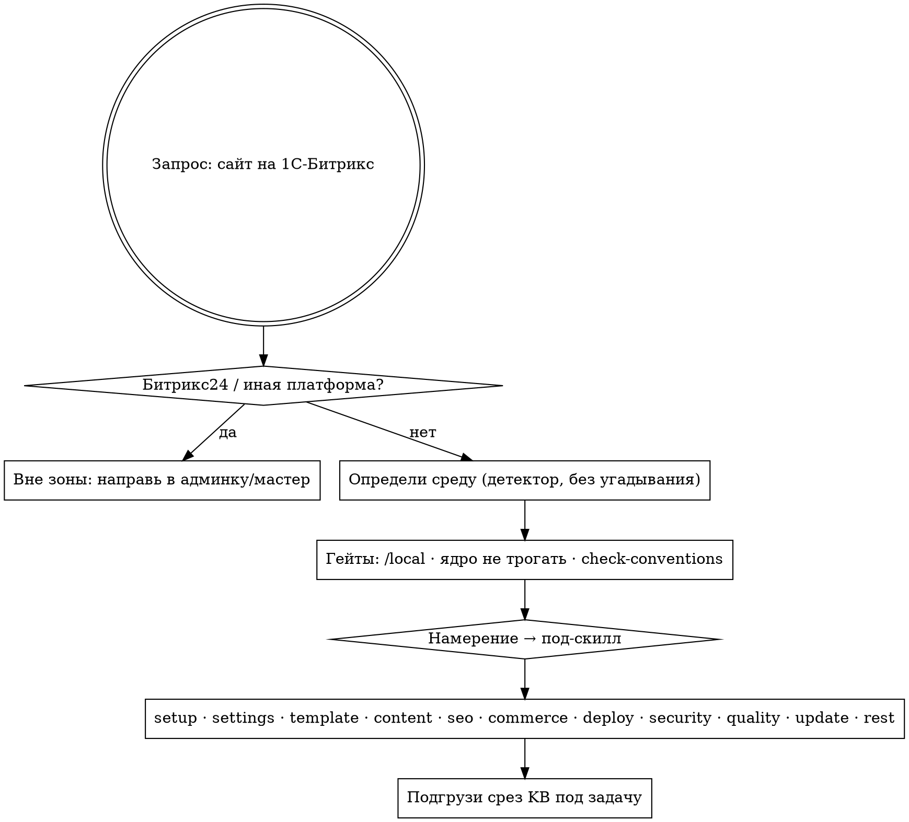

# 1c-bitrix-cms — оркестратор

Точка входа для работы с сайтами на «1С-Битрикс: Управление сайтом». Определи среду, объяви гейты, направь к нужному под-скиллу и подгрузи только релевантный срез базы знаний.

> Знания актуальны для ядра 26.x (выверено на 26.150.0); на более новых ядрах перепроверяйте версионно-зависимые факты.

## Карта решений

Общий поток: отсеки чужую платформу → определи среду → держи гейты → маршрутизируй по намерению → подгрузи только нужный срез базы знаний.

Детали каждого шага — в разделах ниже.

## 1. Определи среду (по сигналам, без угадывания)
- «живой Битрикс» — в корне есть `bitrix/` и `bitrix/.settings.php`, доступен `php`, есть коннект к БД → можно выполнять код и проверять результат.
- «только файлы» — есть проект/`/local` (или пустая папка), БД недоступна → создавай корректные файлы и давай инструкцию запуска (агент/CLI/админка).
- «удалённый» — даны доступы FTP/SSH/REST → работай через них.
- «чистый старт» — Битрикса нет вовсе → начни с под-скилла **1c-bitrix-cms-setup**.
- Конфликт сигналов (например, `bitrix/` есть, но БД недоступна) — задай один уточняющий вопрос. Дефолт при отказе — «только файлы».

Для детерминированной картины окружения можно запустить `../../shared/scripts/detect-bitrix.sh [корень_проекта]` — read-only детектор, отдающий JSON (`mode`, `core_present`, `core_version`, `local_present`, `settings_location`, `php_available`, `encoding`, `d7_available`). Это ground-truth для шага «определи среду»; решение всё равно за тобой, детектор лишь снимает угадывание.

## 2. Гейты-инварианты (держи всегда)
- Не изменять ядро (`/bitrix/modules`, `/bitrix/components/bitrix`). Весь свой код — в `/local`.
- Применять правила безопасности (см. `../../shared/kb/conventions.md`).
- Перед сдачей — прогон проверок: `../../shared/scripts/check-conventions.sh <каталог_проекта>`. Выход `0` сам по себе НЕ означает готовность к сдаче: эвристики безопасности дают только `[REVIEW]`, и «OK» не значит «безопасно». Каждый пункт `[REVIEW]` нужно явно разобрать — устранить или обоснованно отклонить — до сдачи.
- Не использовать сторонние сборки/зеркала ядра.

## 3. Маршрутизация (намерение → под-скилл)
- инфоблоки / компоненты / страницы / вывод контента / интроспекция проекта → **1c-bitrix-cms-content**
- sitemap / ЧПУ / редиректы / мета / robots / Open Graph → **1c-bitrix-cms-seo**
- шаблон сайта / вёрстка / меню / включаемые области → **1c-bitrix-cms-template**
- окружение / установка / структура проекта / CLI → **1c-bitrix-cms-setup**
- `.settings` / конфиг / события / агенты / кэш → **1c-bitrix-cms-settings**
- магазин / каталог / заказы / оплата / доставка / обмен с 1С → **1c-bitrix-cms-commerce**
- деплой / git / CI / миграции структуры / бэкап / мультисайт (механика релиза) → **1c-bitrix-cms-deploy**
- защита / права доступа / уязвимости → **1c-bitrix-cms-security**
- Монитор качества / приёмка / тесты / нагрузка → **1c-bitrix-cms-quality**
- любые обновления ядра/модулей/решений и проверка конфликтов перед апдейтом → **1c-bitrix-cms-update** (deploy сюда не маршрутизирует обновления — он отвечает только за механику релиза: git/CI, миграции структуры, бэкап, мультисайт)
- REST / вебхуки / интеграции с внешними сервисами и CRM → **1c-bitrix-cms-rest**

> Реализованы все под-скиллы: setup · settings · template · content · seo · commerce · deploy · security · quality · update · rest.

## Вне зоны скилла

Скилл НЕ покрывает перечисленное ниже. Не импровизируй и не выдумывай рецепты — направь пользователя в админку Битрикса (модуль/мастер) или честно скажи, что это вне зоны скилла:
- landing / «Сайты24» (внутренняя сборка блоков лендингов) — собирается в визуальном конструкторе, отдельного рецепта нет.
- bizproc — бизнес-процессы, согласования, конструктор БП.
- sender / subscribe — email-маркетинг, рассылки, подписки.
- vote — голосования и опросы.
- веб-аналитика — Яндекс.Метрика / GA4 e-commerce, цели, электронная коммерция.
- push&pull-сервер — реалтайм-уведомления, очереди сообщений.
- bigdata-персонализация — рекомендательные сервисы, персонализация контента.
- clouds — вынос медиа в облако / S3.
- установка marketplace-решений (в отличие от обновления существующих — это под-скилл update).
- мониторинг ошибок (внешние системы трекинга ошибок/APM).

Для перечисленного используй штатную админку Битрикса или прямо сообщи, что задача вне зоны скилла.

## Обновление пакета (необязательно, без навязывания)

Версия установленного пакета — в файле `VERSION` в корне установки. Если на github.com/vrtalex/1c-bitrix-cms-skill есть более свежий релиз, можно один раз за сессию предложить пользователю обновиться — и продолжить задачу независимо от ответа. Не редактируй настройки автоматически, не повторяй предложение и не зашумляй ответ.

## 4. Подгрузка знаний (только нужное)
- общая модель — `../../shared/kb/00-overview.md`
- правила/конвенции — `../../shared/kb/conventions.md`
- «задача → класс/способ» — `../../shared/kb/api-map.md`
- пошаговые рецепты — `../../shared/kb/recipes/`
- эксплуатация — `../../shared/kb/operations.md`
- термины — `../../shared/kb/glossary.md`

Не загружай всю базу целиком — подавай срез под конкретную задачу.
